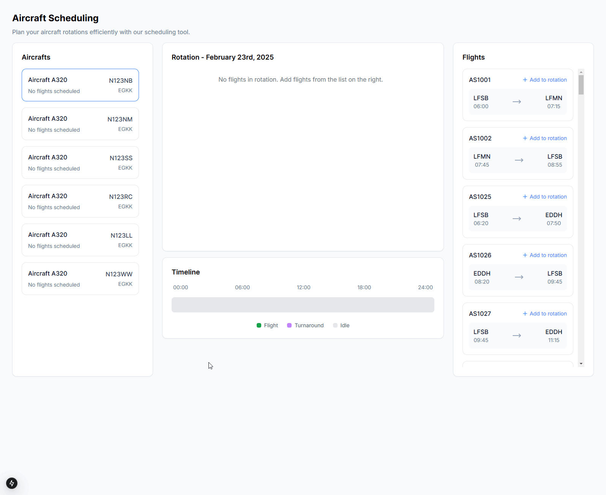
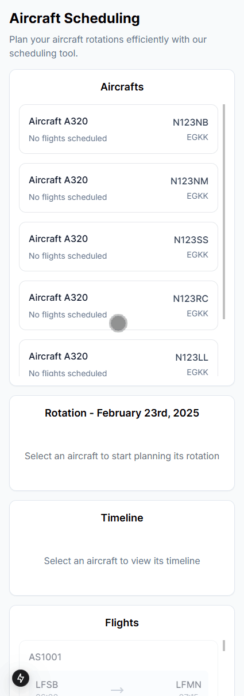
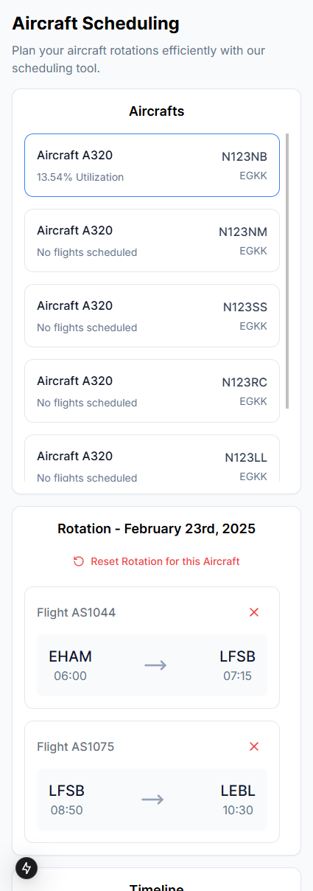

# Aircraft Rotation Management System ✈️

A modern web application built with Next.js and TypeScript for managing aircraft rotations and flight schedules.

---



---

## 📖 Table of Contents

- [🚀 Features](#-features)
- [🛠️ Installation](#-installation)
- [🧪 Testing](#-testing)
- [🏗️ Project Structure](#-project-structure)
- [🔍 Key Features Explained](#-key-features-explained)
  - [Aircraft Selection](#aircraft-selection)
  - [Flight Management](#flight-management)
  - [Timeline Visualization](#timeline-visualization)
- [🎨 Responsiveness and Media](#-responsiveness-and-media)
  - [Mobile](#mobile)
  - [Desktop](#desktop)
- [🙏 Acknowledgments](#-acknowledgments)

## 🚀 Features

- **Aircraft Management**: View and select aircraft from your fleet
- **Flight Scheduling**: Add and remove flights to create rotations
- **Visual Timeline**: Interactive timeline showing flight schedules, turnaround times, and idle periods
- **Real-time Validation**: Instant feedback on schedule conflicts and constraints
- **Responsive Design**: Beautiful UI that works on all devices

## 🛠️ Installation

1. Clone the repository:

   ```bash
   git clone https://github.com/matheuspimentel/aircraft-scheduling.git
   cd aircraft-scheduling
   ```

2. Install dependencies:

   ```bash
   npm install
   # or
   yarn install
   ```

3. Start the development server:

   ```bash
   npm run dev
   # or
   yarn dev
   ```

4. Open [http://localhost:3000](http://localhost:3000) in your browser

## 🧪 Testing

The project includes comprehensive tests using Jest and React Testing Library.

```bash
# Run tests
npm test

# Run tests in watch mode
npm run test:watch

# Generate coverage report
npm run test:coverage
```

## 🏗️ Project Structure

```
src/
├── app/                  # Next.js app directory
│   └── components/       # React components
├── services/             # API services
├── test/                 # Test setup
├── types/                # TypeScript type definitions
└── utils/                # Utility functions
```

## 🔍 Key Features Explained

### Aircraft Selection

- View available aircraft in your fleet
- Select aircraft to plan rotations
- Real-time utilization calculation

### Flight Management

- Add flights to rotation
- Automatic validation of:
  - Aircraft availability
  - Turnaround times
  - Airport matching
  - Schedule conflicts

### Timeline Visualization

- Visual representation of the day's schedule
- Color-coded blocks for:
  - Flights (green)
  - Turnaround times (purple)
  - Idle periods (gray)
- Interactive tooltips with detailed information when hovering disabled cards

## 🎨 Responsiveness and Media

The app was built with a mobile-first approach to ensure excellent usability across all screen sizes:

### Mobile





---

### Desktop


---

## 🙏 Acknowledgments

- Built with [Next.js](https://nextjs.org/)
- Styled with [Tailwind CSS](https://tailwindcss.com/)
- Icons from [Lucide](https://lucide.dev/)
- Tooltips by [Radix UI](https://www.radix-ui.com/)
- Tested with [Jest](https://jestjs.io/) & [React Testing Library](https://testing-library.com/)
